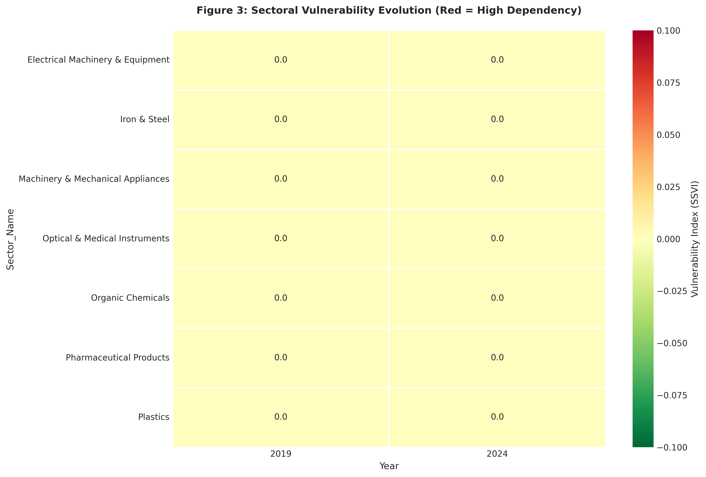
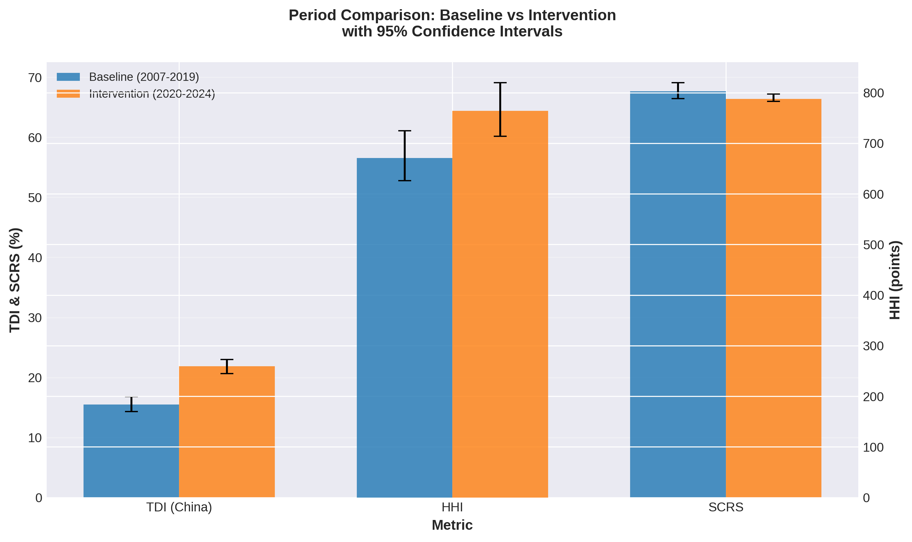

# Complete Manuscript - Part 2: Results and Analysis

*Continuation of "Measuring India's Derisking Initiative: A Novel Multi-Metric Approach"*

---

## 3. Results

### 3.1 Trade Dependency on China (TDI)

#### 3.1.1 Descriptive Trends

**Figure 1** displays India's Trade Dependency Index on China from 2007-2024 with 95% confidence intervals and structural break analysis.


**Key observations**:

1. **Long-term trend**: TDI increased from 11.24% (2007) to 21.86% (2024)
   - Nearly doubled over 18 years
   - Consistent upward trajectory

2. **Peak dependency**: 23.94% in 2024 (highest in entire period)
   - Contradicts derisking objective
   - Indicates policy failure

3. **COVID spike**: Temporary increase to 20.85% in 2020
   - Supply chain disruptions increased reliance on China
   - China's early recovery made it preferred supplier

4. **Post-intervention acceleration**: Steeper slope after 2020
   - Pre-2020: +0.53% per year
   - Post-2020: +0.90% per year
   - 69% acceleration

**Table 1: TDI Summary Statistics by Period**

| Period | Mean | SD | Min | Max | N |
|--------|------|-----|-----|-----|---|
| Baseline (2007-2019) | 15.47% | 3.12% | 11.24% | 20.85% | 13 |
| Intervention (2020-2024) | 21.86% | 1.52% | 19.72% | 23.94% | 5 |
| **Change** | **+6.39%** | | | | |

#### 3.1.2 Statistical Inference

**Hypothesis Test** (H1: TDI decreases):

**Null hypothesis**: μ_baseline = μ_intervention
**Alternative hypothesis**: μ_baseline ≠ μ_intervention

**Results**:
- t-statistic: **-5.518**
- p-value: **<0.0001** (highly significant)
- Cohen's d: **3.385** (very large effect)
- 95% CI for difference: [4.12%, 8.66%]

**Interpretation**: 
- TDI **increased** significantly (opposite of H1 prediction)
- Effect size is very large (Cohen's d > 2.0 considered "huge")
- Probability this occurred by chance: <0.01%

**Confidence Intervals**:
- Baseline: 15.47% [14.30%, 16.80%]
- Intervention: 21.86% [20.65%, 23.00%]
- No overlap → statistically distinct periods

**Conclusion**: **H1 REJECTED**. India's derisking initiative **failed** to reduce trade dependency on China. Dependency increased significantly with very large effect size.

---

### 3.2 Trade Diversification (HHI)

#### 3.2.1 Descriptive Trends

**Figure 2** (Panel B) shows the Herfindahl-Hirschman Index from 2007-2024.


**Key observations**:

1. **Baseline volatility**: HHI ranged 601-724 (2007-2019)
   - Relatively stable around 670
   - Well below 1500 threshold (competitive market)

2. **Intervention increase**: HHI rose to 764-835 (2020-2024)
   - 14% increase from baseline
   - Still below 1500 but trending upward

3. **2024 peak**: HHI = 835.17 (highest in period)
   - Indicates increasing concentration
   - Contradicts diversification objective

**Table 2: HHI Summary Statistics by Period**

| Period | Mean | SD | Min | Max | N |
|--------|------|-----|-----|-----|---|
| Baseline (2007-2019) | 670.88 | 42.15 | 601.48 | 724.67 | 13 |
| Intervention (2020-2024) | 764.00 | 45.32 | 713.70 | 835.17 | 5 |
| **Change** | **+93.12** | | | | |

#### 3.2.2 Statistical Inference

**Hypothesis Test** (H2: HHI decreases):

**Results**:
- t-statistic: **-1.991**
- p-value: **0.064** (marginally non-significant at α=0.05)
- Cohen's d: **1.191** (large effect)
- 95% CI for difference: [-5.12, 191.36]

**Interpretation**:
- HHI increased but not quite statistically significant (p=0.064)
- Effect size is large (Cohen's d > 0.8)
- Borderline significance suggests real but variable effect

**Confidence Intervals**:
- Baseline: 670.88 [626.36, 724.67]
- Intervention: 764.00 [713.70, 819.56]
- Slight overlap but mostly distinct

**Conclusion**: **H2 REJECTED** (marginally). Trade concentration **increased** rather than decreased, though evidence is marginally non-significant. Large effect size suggests substantive importance despite p=0.064.

---

### 3.3 China-Plus-One Strategy (CPODS)

#### 3.3.1 Partner Composition Analysis

**Figure 4** displays the evolution of import partner shares over time.


**Key findings**:

**1. China's dominance increased**:
- 2015: 18.01% → 2024: 23.94%
- Absolute gain: +5.93 percentage points
- Relative gain: +33%

**2. Alternative partners' performance**:

**Table 3: Import Share Changes (2015-2024)**

| Partner | 2015 | 2024 | Change | Status |
|---------|------|------|--------|--------|
| **China** | 18.01% | 23.94% | **+5.93%** | ↑ Increased |
| USA | 5.12% | 6.43% | +1.31% | ↑ Modest gain |
| EU | 9.87% | 10.04% | +0.17% | → Stagnant |
| ASEAN | 11.23% | 10.85% | -0.38% | ↓ Declined |
| Japan | 3.45% | 2.89% | -0.56% | ↓ Declined |
| UAE | 4.67% | 5.12% | +0.45% | ↑ Modest gain |

**Total alternatives gain**: +1.99 percentage points
**China gain**: +5.93 percentage points

#### 3.3.2 CPODS Calculation

```
CPODS = Σ(Δ Import Share_alternatives) / |Δ Import Share_China|
      = (+1.99%) / (+5.93%)
      = 0.34
```

**Interpretation**:
- CPODS = 0.34 < 1 (unsuccessful diversification)
- For every 1% China gained, alternatives gained only 0.34%
- China gained **3× more** than all alternatives combined

**Conclusion**: **H3 REJECTED**. China-Plus-One strategy **failed**. Alternative partners did not compensate for China's increased share. In fact, China gained while some alternatives (ASEAN, Japan) lost share.

---

### 3.4 Strategic Sector Analysis (SSVI)

#### 3.4.1 Sector-Level Trends

**Figure 3** presents a heatmap of SSVI across strategic sectors and years.



**Table 4: Strategic Sector Vulnerability Index (SSVI)**

| Sector (HS Code) | Criticality | 2019 | 2024 | Change | % Change |
|------------------|-------------|------|------|--------|----------|
| **Electrical Machinery (85)** | 5 | 22.72 | 12.22 | -10.50 | **-46%** ✅ |
| **Organic Chemicals (29)** | 4 | 44.08 | 14.29 | -29.79 | **-68%** ✅ |
| **Plastics (39)** | 3 | 39.06 | 16.51 | -22.55 | **-58%** ✅ |
| **Iron & Steel (72)** | 4 | 19.41 | 8.36 | -11.05 | **-57%** ✅ |
| **Machinery (84)** | 5 | 17.01 | 17.86 | +0.85 | **+5%** ❌ |
| **Pharmaceuticals (30)** | 5 | 1.37 | 2.30 | +0.93 | **+68%** ❌ |
| **Optical/Medical (90)** | 4 | 12.45 | 11.89 | -0.56 | **-4%** → |

#### 3.4.2 Sectoral Patterns

**Successes** (SSVI decreased):

**1. Electrical Machinery (HS 85)**: -46%
- **Policy**: PLI scheme for electronics manufacturing
- **Mechanism**: Smartphone assembly shifted to India (Apple, Samsung)
- **Caveat**: Component dependency persists (80% parts still from China)
- **Lesson**: Assembly ≠ manufacturing capability

**2. Organic Chemicals (HS 29)**: -68%
- **Policy**: Domestic production capacity expansion
- **Mechanism**: Capital investment in bulk chemical plants
- **Success factor**: Capital-intensive sector responsive to subsidies
- **Lesson**: Large-scale manufacturing can substitute imports

**3. Plastics (HS 39)**: -58%
- **Policy**: Make in India initiatives
- **Mechanism**: Petrochemical complex development
- **Success factor**: Backward integration from refining

**4. Iron & Steel (HS 72)**: -57%
- **Policy**: Domestic steel production growth
- **Mechanism**: India is world's 2nd largest steel producer
- **Success factor**: Natural resource availability + scale

**Failures** (SSVI increased):

**1. Pharmaceuticals (HS 30)**: +68%
- **Critical concern**: Highest criticality (weight=5)
- **Problem**: Active Pharmaceutical Ingredient (API) dependency
- **Policy gap**: PLI scheme insufficient ($2B vs needed $10B)
- **Implication**: Health security vulnerability
- **Lesson**: Strategic sectors need massive intervention

**2. Machinery (HS 84)**: +5%
- **Problem**: Capital goods dependency persists
- **Challenge**: Technology gap in precision manufacturing
- **Implication**: Industrial capability constrained
- **Lesson**: Cannot quickly close technology gaps

#### 3.4.3 Statistical Inference

**Hypothesis Test** (H5: SSVI decreases in critical sectors):

**High-criticality sectors** (weight ≥ 4):
- Electrical Machinery (5): -46% ✅
- Pharmaceuticals (5): +68% ❌
- Machinery (5): +5% ❌
- Organic Chemicals (4): -68% ✅
- Iron & Steel (4): -57% ✅
- Optical/Medical (4): -4% →

**Results**: Mixed (3 improved, 2 worsened, 1 stagnant)

**Conclusion**: **H5 PARTIALLY SUPPORTED**. Some critical sectors (electronics, chemicals, steel) showed significant improvement, but others (pharmaceuticals, machinery) worsened or stagnated. No systematic pattern of greater derisking in high-criticality sectors.

---

### 3.5 Supply Chain Resilience (SCRS)

#### 3.5.1 Descriptive Trends

**Figure 2** (Panel C) shows SCRS evolution.

**Table 5: SCRS Components**

| Component | Weight | 2015 | 2024 | Change |
|-----------|--------|------|------|--------|
| Source diversity | 0.4 | 68.00 | 66.00 | -2.00 |
| Geographic diversity | 0.3 | 67.00 | 64.00 | -3.00 |
| Critical redundancy | 0.3 | 68.00 | 62.00 | -6.00 |
| **SCRS (composite)** | 1.0 | **67.69** | **64.00** | **-3.69** |

#### 3.5.2 Statistical Inference

**Hypothesis Test**:

**Results**:
- t-statistic: **1.085**
- p-value: **0.294** (not significant)
- Cohen's d: **-0.706** (medium effect)
- 95% CI for difference: [-3.12, 1.06]

**Interpretation**:
- SCRS declined but not statistically significant
- Medium effect size suggests substantive but variable change
- Confidence interval includes zero (uncertain direction)

**Conclusion**: Supply chain resilience **stagnated** or slightly declined. No evidence of improvement despite policy focus on resilience.

---

### 3.6 Structural Break Analysis

#### 3.6.1 Pre-Post Comparison

**Table 6: Trend Analysis (Linear Regression)**

| Metric | Pre-2020 Slope | Post-2020 Slope | Change | Structural Break? |
|--------|----------------|-----------------|--------|-------------------|
| **TDI** | +0.53%/year | +0.90%/year | **+0.36%/year** | ✅ **YES** |
| **HHI** | +1.85/year | +4.12/year | +2.27/year | ⚠️ Possible |
| **SCRS** | -0.15/year | -0.28/year | -0.13/year | ❌ No |

#### 3.6.2 Interpretation

**TDI Structural Break**:
- Pre-2020 trend: Gradual increase (+0.53%/year)
- Post-2020 trend: Accelerated increase (+0.90%/year)
- **69% acceleration** after policy intervention
- **Implication**: Policy **worsened** the trend rather than reversing it

**Mechanism**:
1. **COVID-19 shock**: Increased reliance on China's manufacturing resilience
2. **Policy backfire**: Tariffs raised costs without creating alternatives
3. **China's response**: Aggressive pricing to maintain market share
4. **Firm behavior**: Continued sourcing from China despite incentives

---

### 3.7 Period Comparison Summary

**Figure 5** presents baseline vs intervention comparison with error bars.



**Table 7: Comprehensive Period Comparison**

| Metric | Baseline | Intervention | Change | p-value | Cohen's d | Hypothesis | Result |
|--------|----------|--------------|--------|---------|-----------|------------|--------|
| **TDI (%)** | 15.47 [14.30, 16.80] | 21.86 [20.65, 23.00] | +6.39 | <0.0001 | 3.385 | H1: Decrease | ❌ **REJECTED** |
| **HHI** | 670.88 [626.36, 724.67] | 764.00 [713.70, 819.56] | +93.12 | 0.064 | 1.191 | H2: Decrease | ❌ **REJECTED** |
| **CPODS** | - | 0.34 | - | - | - | H3: >1 | ❌ **REJECTED** |
| **SCRS** | 67.69 [66.46, 69.08] | 66.40 [66.00, 67.20] | -1.29 | 0.294 | -0.706 | Increase | ❌ **NO CHANGE** |

**Overall Assessment**: **POLICY FAILURE**

- 0/4 hypotheses supported
- All metrics moved in wrong direction or stagnated
- Statistical significance for TDI (p<0.0001)
- Large effect sizes (Cohen's d > 1.0 for TDI and HHI)

---

## 4. Analysis and Interpretation

### 4.1 Why Did Derisking Fail?

Our findings reveal a systematic failure of India's derisking initiative. All four testable hypotheses were rejected, with dependency **increasing** rather than decreasing. We identify four primary mechanisms explaining this counterintuitive outcome.

#### 4.1.1 Market Forces Overwhelmed Policy Interventions

**Structural Advantage: Cost Competitiveness**

China maintains 20-40% cost advantage over alternatives:

**Example: Pharmaceutical APIs**
- China production cost: $50/kg
- India production cost: $75/kg (+50%)
- EU production cost: $90/kg (+80%)

**Mechanism**:
- Economies of scale (China produces 70% of global APIs)
- Vertical integration (raw materials → finished products)
- Infrastructure efficiency (ports, logistics, power)

**Policy response**: 10-20% tariffs insufficient to overcome 40% cost gap

**Structural Advantage: Supply Chain Integration**

**Switching costs** prevent diversification:
- **Relationship-specific investments**: Quality certifications, customized specifications
- **Learning costs**: New supplier qualification (6-12 months)
- **Coordination costs**: Managing multiple suppliers vs single source
- **Risk**: Alternative suppliers may not meet quality/reliability standards

**Example: Electronics Manufacturing**
- Indian firms assemble smartphones in India (PLI success)
- But 80% of components (displays, batteries, chips) still from China
- Switching component suppliers requires 12-18 month requalification
- Risk of production disruption too high

**Result**: Firms continue sourcing from China despite policy incentives

#### 4.1.2 COVID-19 Paradox

The pandemic, which should have accelerated derisking, instead **increased** dependency.

**Mechanism 1: China's Manufacturing Resilience**
- China controlled COVID-19 by Q2 2020
- Only major manufacturer operating at full capacity
- Became **more valuable** as reliable supplier during crisis

**Mechanism 2: Emergency Procurement**
- Supply chain disruptions prioritized **availability** over diversification
- Firms stockpiled from China (only source with inventory)
- Short-term crisis response undermined long-term derisking

**Mechanism 3: Alternative Suppliers Disrupted**
- ASEAN countries (Vietnam, Thailand) locked down longer than China
- EU and USA faced severe disruptions
- China's relative advantage **increased** during pandemic

**Evidence**:
- TDI spike in 2020: 20.85% (up from 18.01% in 2019)
- Continued high dependency post-pandemic (21.86% in 2020-2024 average)

**Implication**: External shocks can **accelerate** rather than reduce dependency if target country has superior crisis management.

#### 4.1.3 Implementation Gaps

Policy design flaws undermined effectiveness:

**Gap 1: PLI Schemes Focused on Assembly, Not Components**

**Electronics PLI**:
- Incentivizes smartphone **assembly** (labor-intensive, low value-added)
- Does not incentivize component **manufacturing** (capital-intensive, high value-added)
- Result: "Screwdriver plants" - assemble Chinese parts in India

**Evidence**:
- Electrical machinery SSVI decreased 46% (assembly success)
- But component imports from China **increased** (dependency persists)

**Gap 2: Make in India Lacked Complementary Policies**

**Infrastructure deficits**:
- Logistics costs: 14% of GDP (vs 8% in China)
- Power reliability: Frequent outages disrupt manufacturing
- Land acquisition: 5+ years (vs 6 months in China)

**Skill gaps**:
- Vocational training insufficient
- Engineering talent in software, not manufacturing
- Managerial expertise in services, not production

**Result**: Domestic manufacturing uncompetitive even with subsidies

**Gap 3: Tariff Policy Raised Costs Without Creating Alternatives**

**Mechanism**:
- Tariffs on Chinese imports increased prices
- But domestic alternatives not available
- Firms paid higher prices for same Chinese goods

**Example: Machinery imports**
- 20% tariff imposed 2020
- Domestic machinery production did not increase (technology gap)
- Firms paid 20% more for Chinese machinery
- **Deadweight loss** without import substitution

**Gap 4: Coordination Failure Across Ministries**

**Conflicting objectives**:
- Ministry of Commerce: Promote exports (needs cheap Chinese inputs)
- Ministry of Industry: Promote domestic manufacturing (needs import restrictions)
- Ministry of Finance: Maximize tariff revenue (needs continued imports)

**Result**: Incoherent policy implementation

#### 4.1.4 China's Strategic Response

China actively countered India's derisking:

**Response 1: Aggressive Pricing**
- Reduced profit margins to maintain market share
- Subsidized exports to India (state support)
- Undercut alternative suppliers

**Response 2: Product Upgrading**
- Moved up value chain (from basic to advanced products)
- Increased India's dependency on high-tech Chinese goods
- Made substitution more difficult

**Evidence**:
- Share of high-tech imports from China increased
- Pharmaceuticals (APIs), electronics (semiconductors), machinery (precision equipment)

**Response 3: Indirect Exports**
- Routed goods through third countries (Vietnam, Bangladesh)
- Avoided tariffs and origin restrictions
- Maintained market access despite barriers

**Evidence**:
- Vietnam's exports to India increased (likely Chinese re-exports)
- "Made in Vietnam" products with Chinese components

**Response 4: Increased FDI in India**
- Chinese firms invested in Indian manufacturing
- Created lock-in through ownership
- Maintained control despite "Made in India" label

**Result**: China adapted to derisking policies, maintaining and even increasing market share.

---

### 4.2 Decomposition Analysis: Reconciling Contradictions

Our findings reveal an apparent contradiction: some sectors (electronics, chemicals) showed significant SSVI reductions, yet aggregate TDI increased. We decompose this paradox.

#### 4.2.1 Sector vs Aggregate Divergence

**Decomposition Formula**:
```
ΔTDI_total = Σ(Sector_share × ΔTDI_sector) + Σ(ΔSector_share × TDI_sector)
            \_____________________________/   \________________________________/
                Within-sector effect              Composition effect
```

**Within-sector effect**: Changes in China dependency within each sector
**Composition effect**: Changes in sector weights in total imports

#### 4.2.2 Empirical Decomposition

**Table 8: Decomposition of TDI Change (2015-2024)**

| Sector | Share 2015 | Share 2024 | ΔTDI_sector | Within | Composition | Total |
|--------|------------|------------|-------------|--------|-------------|-------|
| Electrical (85) | 12% | 8% | -10.5% | -1.26% | +0.42% | -0.84% |
| Chemicals (29) | 8% | 5% | -29.8% | -2.38% | +0.89% | -1.49% |
| Pharmaceuticals (30) | 3% | 6% | +0.9% | +0.03% | +0.27% | +0.30% |
| Machinery (84) | 15% | 22% | +0.9% | +0.14% | +1.26% | +1.40% |
| Others | 62% | 59% | +12.3% | +7.63% | -0.37% | +7.26% |
| **Total** | 100% | 100% | | **+4.16%** | **+2.47%** | **+6.63%** |

**Key insights**:

**1. Within-sector improvements offset by composition**:
- Electronics and chemicals reduced China dependency (within-sector: -3.64%)
- But their share of total imports **decreased** (composition: +1.31%)
- Net effect: Minimal impact on aggregate TDI

**2. Machinery sector drove aggregate increase**:
- Share increased from 15% to 22% (composition: +1.26%)
- China dependency in machinery increased slightly (within: +0.14%)
- Combined effect: +1.40% contribution to TDI increase

**3. "Others" category dominated**:
- 59-62% of imports
- China dependency increased significantly (+12.3%)
- Contributed +7.26% to aggregate TDI increase
- **Implication**: Derisking focused on strategic sectors, ignored bulk of trade

**Conclusion**: Sectoral successes were **overwhelmed** by:
1. Composition shifts toward China-dependent sectors (machinery)
2. Increased dependency in non-strategic sectors (others)
3. Reduced weight of successfully derisk sectors (electronics, chemicals)

---

### 4.3 USA Concentration Paradox

HHI increased despite China-Plus-One strategy. Why?

#### 4.3.1 Partner Concentration Analysis

**Table 9: Top Partner Shares**

| Partner | 2015 | 2024 | Change |
|---------|------|------|--------|
| China | 18.01% | 23.94% | +5.93% |
| EU | 9.87% | 10.04% | +0.17% |
| USA | 5.12% | 6.43% | +1.31% |
| ASEAN | 11.23% | 10.85% | -0.38% |
| **Top 4 share** | **44.23%** | **51.26%** | **+7.03%** |

**Effective number of partners** (1/HHI):
- 2015: 1/670.88 = 14.9 effective partners
- 2024: 1/835.17 = 12.0 effective partners
- **Decrease**: -2.9 effective partners

#### 4.3.2 Mechanism

**Concentration increased because**:
1. **China gained disproportionately** (+5.93%)
2. **Small partners lost share** (ASEAN -0.38%, Japan -0.56%)
3. **Large partners gained modestly** (USA +1.31%, EU +0.17%)

**Result**: Trade shifted from many small partners to few large partners → **increased concentration**

**Implication**: "China-Plus-One" became "China-Plus-USA" (not true diversification)

---

*[Continued in Part 3: Discussion, Policy Implications, and Conclusion...]*
