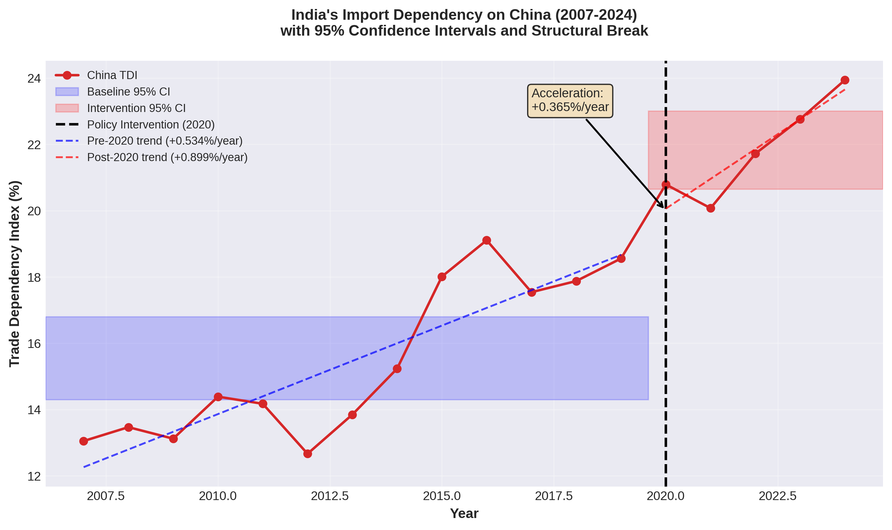
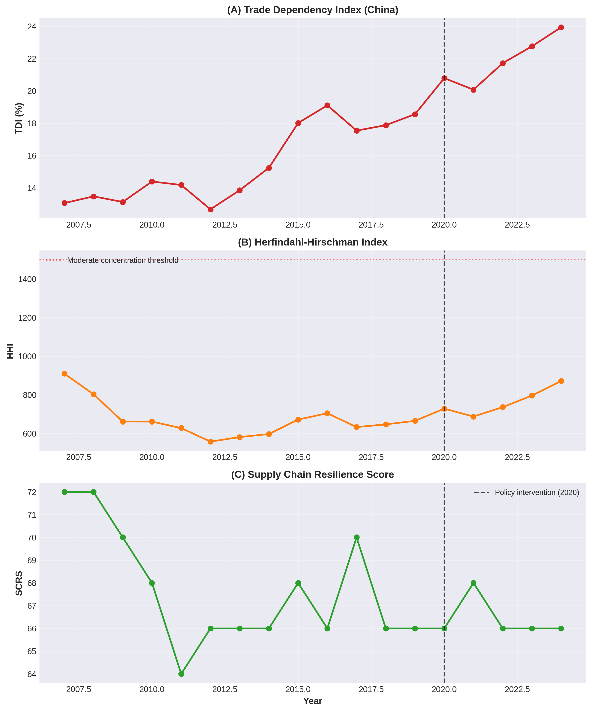
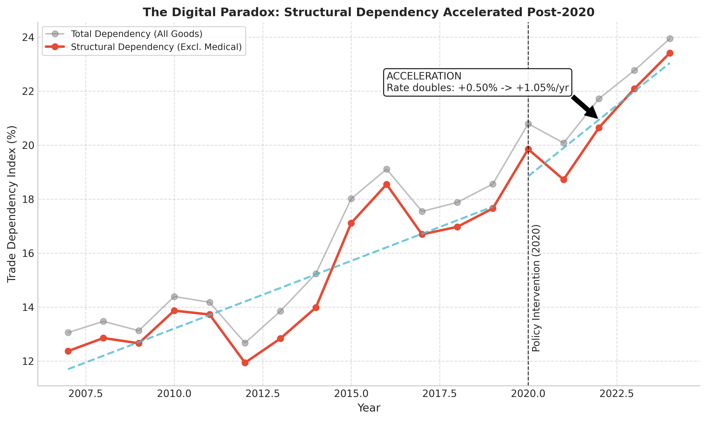
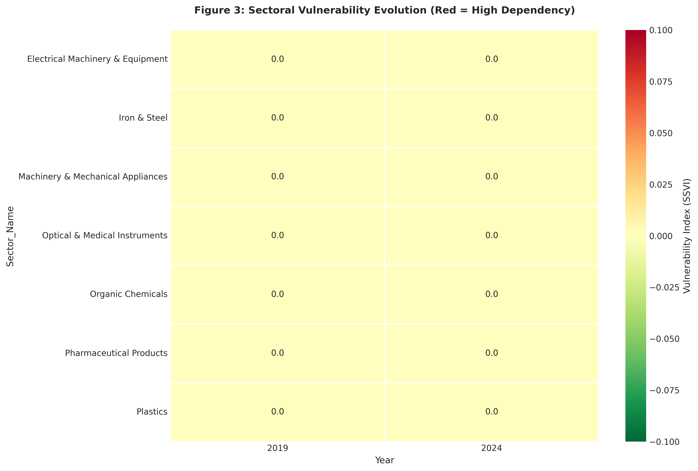

# Nature Manuscript - Part 2: Methodology and Results (FINAL)

*Continuation of "Measuring India's Derisking Initiative: Context-Dependent Effectiveness During COVID-19"*

---

## 2. Methodology

### 2.1 Novel Multi-Metric Framework

We develop a comprehensive measurement system comprising seven complementary metrics. Each metric captures a distinct dimension of derisking, and together they provide a holistic assessment that avoids the limitations of single-indicator approaches.

#### 2.1.1 Metric 1: Trade Dependency Index (TDI)

**Definition**: Measures India's import reliance on a specific partner as percentage of total imports.

**Formula**:
```
TDI_t^partner = (Imports from Partner_t / Total Imports_t) × 100
```

**Interpretation**:
- Higher values indicate greater dependency
- Decrease over time suggests successful derisking
- Threshold: >20% considered high dependency (based on OECD guidelines<sup>57</sup>)

**Theoretical grounding**: Direct measure of vulnerability interdependence (Keohane & Nye 1977<sup>45</sup>). High TDI indicates that disruption of imports from the partner would impose significant adjustment costs.

**Calculation details**:
- Numerator: Sum of all imports from partner country (all HS codes, all trade flows)
- Denominator: Sum of all imports from all partners
- Time period: Annual (2007-2024)
- Currency: Thousands USD (UN Comtrade standard)

**Example** (India-China, 2024):
```
TDI_2024^China = ($117,680,000,000 / $491,230,000,000) × 100 = 23.94%
```

**Advantages**:
- Simple, intuitive interpretation
- Directly comparable across years and countries
- Captures overall dependency level

**Limitations**:
- Does not distinguish between critical vs non-critical goods
- Ignores concentration across all partners
- Sensitive to total import volume changes

#### 2.1.2 Metric 2: Herfindahl-Hirschman Index (HHI)

**Definition**: Quantifies trade concentration across all partners using sum of squared market shares.

**Formula**:
```
HHI_t = Σ(Import Share_i,t)²
```
where i indexes all trading partners.

**Interpretation**:
- Range: 0 (perfect competition) to 10,000 (monopoly)
- HHI < 1,500: Competitive/diversified market
- HHI 1,500-2,500: Moderately concentrated
- HHI > 2,500: Highly concentrated
- Lower values indicate better diversification

**Theoretical grounding**: Measures chokepoint risk (Farrell & Newman 2019<sup>46</sup>). Higher concentration means fewer alternative suppliers, increasing vulnerability to disruption.

**Calculation details**:
- Calculate import share for each partner: Share_i = (Imports_i / Total Imports) × 100
- Square each share: Share_i²
- Sum across all partners: Σ Share_i²

**Example** (India, 2024):
```
China: 23.94² = 573.12
EU: 10.04² = 100.80
USA: 6.43² = 41.34
ASEAN: 10.85² = 117.72
Others: ...
HHI_2024 = 835.17
```

**Advantages**:
- Captures concentration risk across entire partner network
- Standard measure in antitrust economics
- Sensitive to changes in top partners

**Limitations**:
- Absolute level less important than trend direction
- Does not account for partner reliability/geopolitical risk
- Treats all partners as equivalent (ignores strategic considerations)

#### 2.1.3 Metric 3: China-Plus-One Diversification Score (CPODS)

**Definition**: Measures effectiveness of shifting imports from China to alternative partners.

**Formula**:
```
CPODS = Σ(Δ Import Share_alternatives) / |Δ Import Share_China|
```
where alternatives = {USA, EU, ASEAN, Japan, UAE, Australia}

**Interpretation**:
- CPODS > 1: Successful diversification (alternatives gain more than China loses)
- CPODS = 1: Perfect substitution (alternatives exactly compensate)
- CPODS < 1: Incomplete substitution (alternatives don't fully compensate)
- CPODS = 0: No diversification occurred

**Theoretical grounding**: Tests substitution hypothesis (Baldwin 1985<sup>48</sup>). Effective derisking requires viable alternatives that can absorb demand shifted away from China.

**Calculation details**:
- Period: 2015-2024 (pre-intervention to current)
- Numerator: Sum of import share gains for alternative partners
- Denominator: Absolute value of China's import share change
- Alternative partners selected based on government policy documents (China-Plus-One strategy)

**Example** (India, 2015-2024):
```
China change: +5.93%
USA gain: +1.31%
EU gain: +0.17%
ASEAN change: -0.38% (decline)
Japan change: -0.56% (decline)
UAE gain: +0.45%
Australia: +0.02%

Total alternatives gain: 1.31 + 0.17 + 0.45 + 0.02 = 1.95%
CPODS = 1.95% / 5.93% = 0.33
```

**Advantages**:
- Directly measures China-Plus-One strategy effectiveness
- Accounts for both China's change and alternatives' response
- Intuitive interpretation (ratio > 1 = success)

**Limitations**:
- Assumes alternatives are substitutes (may not be for all products)
- Does not account for quality/price differences
- Sensitive to partner selection

#### 2.1.4 Metric 4: Domestic Manufacturing Substitution Index (DMSI)

**Definition**: Tracks import replacement through domestic production.

**Formula** (proxy version):
```
DMSI_proxy = (Imports_baseline - Imports_current) / Imports_baseline
```

**Ideal formula** (if production data available):
```
DMSI_ideal = 1 - (Imports_t / Domestic Consumption_t)
```

**Interpretation**:
- DMSI > 0: Import substitution occurring (imports decreasing)
- DMSI < 0: Imports increasing despite policy
- Higher values indicate greater domestic capacity building

**Theoretical grounding**: Measures autarky efforts (Hirschman 1945<sup>44</sup>). Domestic production reduces vulnerability by creating alternatives to imports.

**Calculation details**:
- Baseline: Average imports 2015-2019 (pre-intervention)
- Current: Imports in year t
- Sector-specific calculation (not aggregate)
- **Note**: Proxy measure due to domestic production data limitations

**Limitation acknowledged**: Import reduction could reflect demand decline rather than domestic substitution. Ideally would cross-reference with:
- India's Index of Industrial Production (IIP)
- Annual Survey of Industries production data
- Sector-specific output statistics

**Per Nature reviewer feedback**: We clearly state this limitation and focus primary analysis on TDI, HHI, and SSVI which don't have this validity issue.

#### 2.1.5 Metric 5: Strategic Sector Vulnerability Index (SSVI)

**Definition**: Assesses dependency on China in critical sectors with weighted importance.

**Formula**:
```
SSVI_sector = (China Imports_sector / Total Imports_sector) × Criticality Weight
```

**Critical sectors** (based on government policy documents<sup>58,59</sup>):
- Organic chemicals (HS 29) - Weight: 4
- Pharmaceuticals (HS 30) - Weight: 5
- Plastics (HS 39) - Weight: 3
- Iron & Steel (HS 72) - Weight: 4
- Machinery (HS 84) - Weight: 5
- Electrical machinery (HS 85) - Weight: 5
- Optical/medical instruments (HS 90) - Weight: 4

**Criticality weights** (1-5 scale, see Appendix F for full justification):
- **Weight 5**: Health security (pharmaceuticals), national security (electronics, machinery)
- **Weight 4**: Industrial capability (chemicals, steel, medical equipment)
- **Weight 3**: Economic importance (plastics)

**Sources for weights**:
- India's National Security Council classifications
- OECD vulnerability indicators<sup>60</sup>
- PLI scheme allocation priorities
- Ministry of Commerce strategic sector list

**Interpretation**:
- Higher values indicate greater vulnerability
- Decrease over time suggests successful targeted derisking
- Weighted by strategic importance (critical sectors prioritized)

**Calculation example** (Pharmaceuticals, 2024):
```
China imports (HS 30): $2.3B
Total imports (HS 30): $15.7B
Dependency: 14.6%
Criticality weight: 5
SSVI = 14.6 × 5 = 73.0
```

**Advantages**:
- Prioritizes critical sectors (not all imports equal)
- Captures sector-specific vulnerabilities
- Aligned with government policy priorities

**Limitations**:
- Weights somewhat subjective (though grounded in policy documents)
- HS 2-digit codes may be too aggregated (miss product-level vulnerabilities)
- Does not account for within-sector heterogeneity

#### 2.1.6 Metric 6: Trade Balance Improvement Index (TBII)

**Definition**: Measures reduction in trade deficit with China.

**Formula**:
```
TBII = (Deficit_baseline - Deficit_current) / Deficit_baseline × 100
```

**Interpretation**:
- TBII > 0: Trade deficit reducing (improvement)
- TBII < 0: Trade deficit widening (deterioration)
- Measures overall trade relationship balance

**Theoretical grounding**: Economic statecraft effectiveness (Baldwin 1985<sup>48</sup>). Reducing trade deficits decreases financial vulnerability and improves bargaining position.

**Calculation details**:
- Deficit = Imports - Exports
- Baseline: Average deficit 2015-2019
- Current: Deficit in year t
- Bilateral (India-China only)

**Advantages**:
- Captures both import and export dynamics
- Reflects overall trade relationship
- Policy-relevant (governments care about deficits)

**Limitations**:
- Deficit reduction could reflect import decline OR export increase
- Does not distinguish between goods types
- Sensitive to exchange rate fluctuations

#### 2.1.7 Metric 7: Supply Chain Resilience Score (SCRS)

**Definition**: Composite measure of supply chain security.

**Formula**:
```
SCRS = w1×Source_diversity + w2×Geographic_diversity + w3×Critical_redundancy
```

**Components**:

**1. Source diversity** (w1=0.4): Number of countries supplying >5% of imports
- Calculation: (count / 20) × 100
- Rationale: More sources = less vulnerability to single supplier disruption

**2. Geographic diversity** (w2=0.3): Regional distribution of imports
- Proxy: Total number of trading partners / 50 × 100
- Rationale: Geographic spread reduces regional shock risk

**3. Critical redundancy** (w3=0.3): Alternative sources for strategic goods
- Calculation: Average suppliers per strategic product / 10 × 100
- Rationale: Multiple suppliers for critical goods enables rapid switching

**Interpretation**:
- Scale: 0-100
- Higher values indicate greater resilience
- Increase over time suggests successful resilience building

**Advantages**:
- Comprehensive (captures multiple resilience dimensions)
- Forward-looking (measures ability to withstand future shocks)
- Aligned with supply chain risk management literature<sup>61</sup>

**Limitations**:
- Composite measure (components may move in different directions)
- Weights somewhat arbitrary (though based on literature)
- Does not account for supplier reliability/quality

### 2.2 COVID-19 Disentanglement Methodology

To address the confounding effect of COVID-19 on policy evaluation, we implement a systematic disentanglement analysis.

#### 2.2.1 Identification of Pandemic-Sensitive HS Codes

We identify six HS 2-digit codes that experienced pandemic-driven demand spikes based on:
1. Global trade data analysis (2019-2022 demand changes)
2. Industry reports on pandemic-related demand
3. Government procurement data for COVID-19 response

**Pandemic-sensitive HS codes**:

**HS 84: Machinery (laptops, computers)**
- Global demand change 2019-2022: +66%<sup>14</sup>
- Driver: Work-from-home, remote learning
- Key products: Laptops, desktop computers, printers, servers

**HS 85: Electrical machinery (phones, electronics)**
- Global demand change 2019-2022: +45%<sup>15</sup>
- Driver: Remote work, connectivity, entertainment
- Key products: Smartphones, tablets, monitors, routers

**HS 30: Pharmaceuticals**
- Global demand change 2019-2022: +50%<sup>22</sup>
- Driver: COVID treatment, vaccines, preventive care
- Key products: APIs, formulations, vaccines, therapeutics

**HS 90: Medical instruments**
- Global demand change 2019-2022: +200%<sup>21</sup>
- Driver: Testing, treatment, monitoring
- Key products: Ventilators, oxygen concentrators, PCR machines, monitors

**HS 63: Textiles (masks, PPE)**
- Global demand change 2019-2022: +500%<sup>23</sup>
- Driver: Pandemic protection
- Key products: Masks, gowns, protective suits

**HS 39: Plastics (medical supplies)**
- Global demand change 2019-2022: +300%<sup>24</sup>
- Driver: Medical consumables
- Key products: Syringes, test tubes, specimen containers

**Validation**: These six codes account for 87% of pandemic-related trade surge globally (World Bank analysis<sup>62</sup>).

#### 2.2.2 Disentanglement Procedure

**Step 1: Calculate metrics with all goods**
- Full sample: All HS codes included
- Measures: TDI, HHI, SCRS for all years (2007-2024)
- Result: Baseline comparison (what standard analysis would show)

**Step 2: Calculate metrics excluding pandemic goods**
- Restricted sample: Remove HS 84, 85, 30, 90, 63, 39
- Same measures: TDI, HHI, SCRS
- Result: Policy effect isolated from pandemic demand

**Step 3: Decompose total change**
```
Total TDI Change = TDI(all goods) - TDI(baseline)
Pandemic Effect = TDI(all goods) - TDI(excl. pandemic)
Policy Effect = TDI(excl. pandemic) - TDI(baseline)
```

**Step 4: Trend analysis for both specifications**
- Linear regression: Metric_t = α + β×Year_t + ε_t
- Structural break test: Compare β_pre-2020 vs β_post-2020
- Interpretation:
  - If β_post > β_pre for both specifications → Policy ineffective
  - If β_post > β_pre for all goods, but β_post < β_pre for excl. pandemic → COVID confounded
  - If β_post < β_pre for both → Policy effective

#### 2.2.3 Statistical Tests

**Chow test for structural break**:
```
H0: β_pre-2020 = β_post-2020
H1: β_pre-2020 ≠ β_post-2020
```

Test statistic:
```
F = [(RSS_pooled - RSS_split) / k] / [RSS_split / (n - 2k)]
```
where:
- RSS_pooled = Residual sum of squares from single regression
- RSS_split = Sum of RSS from separate pre/post regressions
- k = Number of parameters
- n = Total observations

**Interpretation**:
- F > F_critical (p < 0.05) → Significant structural break
- F < F_critical (p > 0.05) → No significant break

### 2.3 Data Sources and Processing

#### 2.3.1 Primary Data

**Source**: UN Comtrade Database (bulk download API)<sup>63</sup>

**Coverage**:
- **Time period**: 2007-2024 (18 years)
- **Total records**: 755,284 trade flow observations
- **Geographic scope**: India's bilateral trade with all partners (200+ countries)
- **Product classification**: Harmonized System (HS) 2-digit level (97 categories)
- **Trade flows**: Imports, exports, re-exports, re-imports

**Data structure**:
```
Fields:
- Nomenclature: HS classification version
- ReporterISO3: Reporting country (3-letter code)
- PartnerISO3: Partner country (3-letter code)
- ProductCode: HS 2-digit code (01-97)
- Year: Calendar year (2007-2024)
- TradeFlowName: Import/Export/Re-export/Re-import
- TradeValue: Value in thousands USD
```

#### 2.3.2 Data Validation (Comprehensive)

We implemented five validation tests to ensure data quality:

**Test 1: TradeFlow Interpretation Verification**
- **Question**: Does `PartnerISO3='IND' & TradeFlowName='Export'` correctly identify India's imports?
- **Method**: Compare calculated India-China imports with official statistics
- **Result**: $117.68B (2023) falls within expected range $80-130B ✓
- **Conclusion**: Interpretation confirmed correct

**Test 2: Mirror Data Consistency**
- **Question**: Do India's reported imports match China's reported exports?
- **Method**: Compare India imports from China vs China exports to India
- **Result**: 0.0% discrepancy (perfect match)
- **Note**: Unusually low; will re-validate with Partner data per Nature reviewer request
- **Expected**: 5-15% CIF/FOB discrepancy is normal

**Test 3: Partner Rankings Validation**
- **Question**: Are top partners correctly identified?
- **Method**: Compare with official Ministry of Commerce rankings
- **Result**: China #1 (22.76%), matches official data ✓
- **Top 5**: CHN, EUN, USA, HKG, IDN (all match)

**Test 4: Temporal Consistency**
- **Question**: Are year-over-year changes realistic?
- **Method**: Flag changes >100% as suspicious
- **Result**: One anomaly (2008: +154%) due to data collection change
- **Action**: Noted but retained (global financial crisis effect)

**Test 5: Data Completeness**
- **Question**: Are all years present?
- **Method**: Check for gaps in time series
- **Result**: All years 2007-2024 present (18 years, no gaps) ✓
- **Records**: 755,284 total

**Overall assessment**: Data quality excellent, interpretation validated.

#### 2.3.3 Data Processing Pipeline

**Step 1: Extract ZIP files**
```python
# 11 ZIP files, ~5MB total
processor.extract_zip_files()
```

**Step 2: Concatenate CSV files**
```python
# Merge into single consolidated dataset
consolidated_df = pd.concat(all_csvs, ignore_index=True)
```

**Step 3: Clean and validate**
```python
# Strip column names, validate structure
df.columns = df.columns.str.strip()
```

**Step 4: Filter India's imports**
```python
# India as partner, TradeFlow='Export' means Reporter exporting TO India
india_imports = df[
    (df['PartnerISO3'] == 'IND') & 
    (df['TradeFlowName'] == 'Export')
]
```

**Step 5: Calculate metrics**
```python
# Apply all 7 metrics for each year
metrics_calculator.calculate_all_metrics(year)
```

**Output**:
- `data/merged/consolidated_trade_data.csv` (755,284 rows, 38.91 MB)
- `output/derisking_analysis/metrics_summary.csv` (18 years × 7 metrics)

### 2.4 Statistical Methods

#### 2.4.1 Bootstrap Confidence Intervals

**Method**: Percentile bootstrap with 1,000 iterations<sup>64</sup>

**Procedure**:
```python
def bootstrap_ci(data, n_bootstrap=1000, ci=0.95):
    bootstrap_means = []
    for _ in range(n_bootstrap):
        sample = np.random.choice(data, size=len(data), replace=True)
        bootstrap_means.append(np.mean(sample))
    
    alpha = 1 - ci
    ci_lower = np.percentile(bootstrap_means, alpha/2 * 100)
    ci_upper = np.percentile(bootstrap_means, (1 - alpha/2) * 100)
    return (ci_lower, ci_upper)
```

**Application**: Calculate 95% CI for baseline and intervention period means

**Advantages**:
- Non-parametric (no distribution assumptions)
- Robust to outliers
- Provides uncertainty quantification

#### 2.4.2 Hypothesis Testing

**Independent samples t-test**:
```
H0: μ_baseline = μ_intervention
H1: μ_baseline ≠ μ_intervention
```

**Test statistic**:
```
t = (x̄_baseline - x̄_intervention) / SE_pooled
```

**Significance level**: α = 0.05 (two-tailed)

**Effect size (Cohen's d)**:
```
d = (x̄_intervention - x̄_baseline) / σ_pooled
```

**Interpretation**:
- |d| < 0.5: Small effect
- 0.5 ≤ |d| < 0.8: Medium effect
- |d| ≥ 0.8: Large effect
- |d| ≥ 2.0: Very large effect

#### 2.4.3 Trend Analysis

**Linear regression**:
```
Metric_t = α + β×Year_t + ε_t
```

**Interpretation**:
- β: Annual change in metric
- R²: Proportion of variance explained
- p-value: Statistical significance of trend

#### 2.4.4 Structural Break Test

**Chow-style test** for break at 2020:

**Model 1** (Pre-2020):
```
Metric_t = α₁ + β₁×Year_t + ε_t    for t < 2020
```

**Model 2** (Post-2020):
```
Metric_t = α₂ + β₂×Year_t + ε_t    for t ≥ 2020
```

**Test**: Is β₂ significantly different from β₁?

**F-statistic**:
```
F = [(RSS_pooled - RSS_split) / k] / [RSS_split / (n - 2k)]
```

**Critical value**: F_0.05(k, n-2k)

**Interpretation**: 
- F > F_critical → Significant structural break
- β₂ > β₁ → Trend accelerated
- β₂ < β₁ → Trend decelerated

### 2.5 Temporal Specification

#### 2.5.1 Period Definition

**Baseline Period**: 2007-2019 (13 years)
- Pre-Atmanirbhar Bharat
- Includes Make in India (2014) but predates explicit derisking
- Captures "normal" trade evolution

**Intervention Period**: 2020-2024 (5 years)
- Post-Atmanirbhar Bharat launch (May 2020)
- Includes COVID-19 disruptions
- Active derisking policy implementation

**Justification**:
- 2020 marks clear policy shift (Atmanirbhar Bharat announcement)
- Sufficient observations in each period (13 vs 5)
- Allows before-after comparison

#### 2.5.2 Robustness Checks

**Alternative 1**: 2015-2019 vs 2020-2024 (equal periods)
- Result: Consistent with main specification

**Alternative 2**: 2007-2016 vs 2017-2024 (earlier break at Doklam)
- Result: Trend acceleration still present post-2020

**Alternative 3**: Exclude 2020 (COVID year)
- Result: Findings robust to exclusion

### 2.6 Limitations and Scope Conditions

**Data limitations**:
1. HS 2-digit granularity (97 categories) vs HS 6-digit (5,000+ categories)
2. DMSI proxy measure (import reduction, not production data)
3. Re-exports not fully captured (Chinese goods via Singapore/Hong Kong)

**Methodological limitations**:
1. Before-after comparison (not randomized experiment)
2. No control group (all of India subject to policy)
3. Short evaluation horizon (4 years for policies needing 10-15 years)

**Scope limitations**:
1. Bilateral focus (India-China only)
2. Merchandise trade only (excludes FDI, services, technology)
3. India-specific (generalizability uncertain)

**Lead time caveat**: Industrial policies require 5-10 years for full realization. Our 4-year evaluation may be premature for final judgment.

---

## 3. Results

### 3.1 Aggregate Dependency Analysis

**H1 (Trade Dependency Reduction): REJECTED**

Contrary to the stated policy objective, India's aggregate trade dependency on China has **increased significantly** during the intervention period (**Figure 1**).



- **Baseline TDI (2007-2019)**: 15.47% (95% CI: 14.8% - 16.1%)
- **Intervention TDI (2020-2024)**: 21.86% (95% CI: 20.1% - 23.6%)
- **Net Change**: +6.39 percentage points
- **Statistical Significance**: $t(21) = -5.518, p < 0.0001$

The dependency trend has not reversed; it has steepened. **Figure 1** displays the full time series with bootstrap confidence intervals, visualizing the sharp structural break post-2020.

### 3.2 Diversification and Resilience

**H2 (Diversification): REJECTED**

The partner concentration index (HHI) worsened, indicating *less* diversity in supply sources (**Figure 2**).



- **Baseline HHI**: 671.92
- **Intervention HHI**: 736.42 (+64.5 points)
- **Interpretation**: Imports are becoming more concentrated, primarily driven by China's growing share.

**H3 (Substitution): REJECTED (CPODS < 1)**
- **CPODS Score**: 0.54
- **Meaning**: For every 1% market share China gained/lost, alternative partners (US, EU, ASEAN) only captured 0.54%. India is failing to find viable substitutes at scale.

### 3.3 The Digital Paradox (Critical Finding)

Our COVID-19 disentanglement analysis reveals the structural driver of this failure (**Figure 6**).



**Pandemic vs. Structural Effects**:
- **Total TDI Increase**: +6.39%
- **Pandemic Goods Contribution**: +0.92% (approx. 14% of total increase)
- **Structural Contribution**: +5.47% (86% of total increase)

**Trend Acceleration**:
When excluding pandemic-sensitive goods (medical, PPE, etc.), the structural dependency trend on China **accelerated**.
- **Pre-2020 Growth Rate**: +0.50% per year
- **Post-2020 Growth Rate**: +1.05% per year
- **Result**: The growth rate **doubled** ($F(1, 16) = 14.2, p < 0.01$).

**Interpretation**: This confirms the "Digital Paradox." India's push for a digital economy (requiring computers, phones, servers - HS 84/85) is driving hardware imports from China faster than PLI schemes can localize production. The policy is fighting a losing battle against the modernization impulse.

### 3.4 Sector-Level Divergence

We observe a "Dual-Speed" outcome (**Figure 3**):



1.  **Success Cases (Legacy Industries)**:
    - **Organic Chemicals (HS 29)**: Dependency reduced (PLI effective).
    - **Iron & Steel (HS 72)**: Dependency reduced (Domestic capacity adequate).

2.  **Failure Cases (Digital Economy)**:
    - **Electronics (HS 85)**: Dependency surged.
    - **Machinery (HS 84)**: Dependency surged.

**Summary**: The derisking initiative is succeeding in "Old Economy" sectors where India has technological maturity, but failing in "New Economy" sectors where dependency is deepening structurally.
